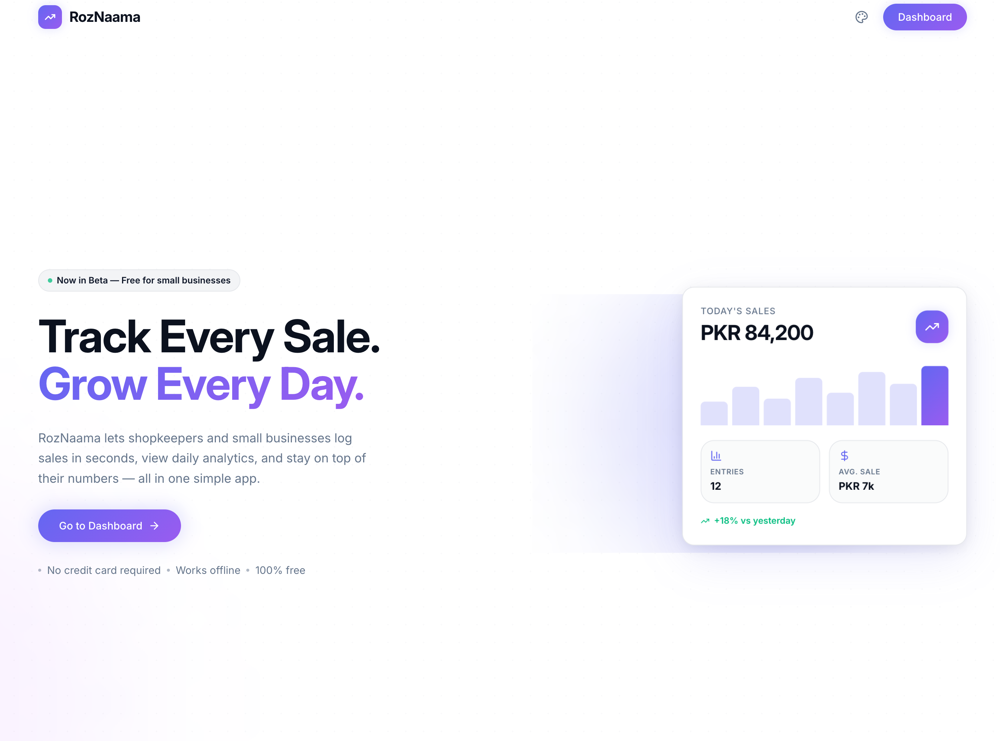
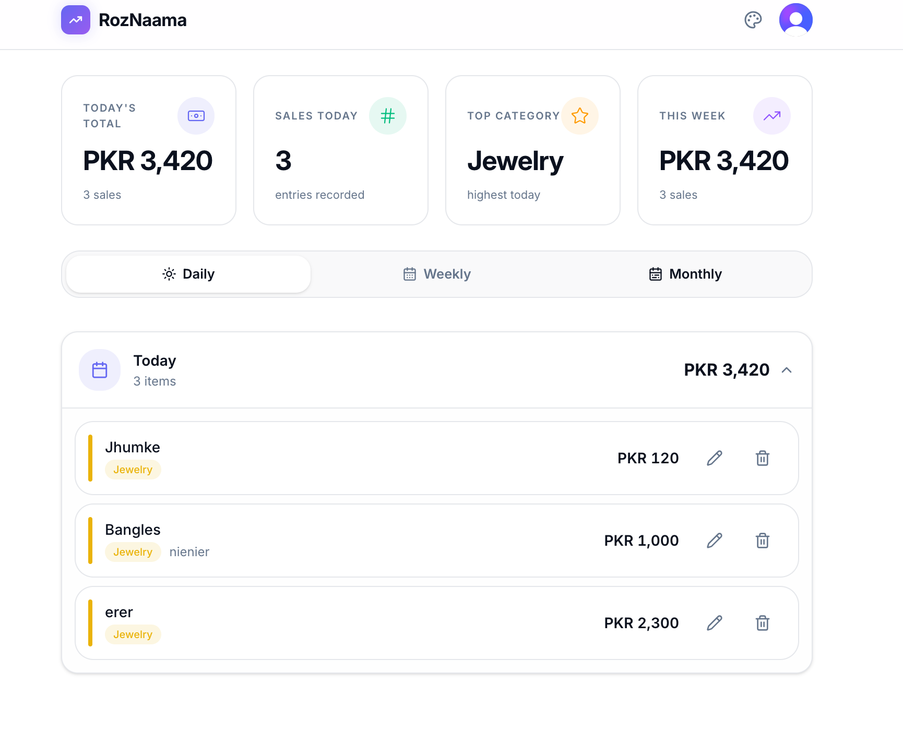

# RozNaama

**Daily sales tracking for small businesses and shopkeepers.**

[](https://react.dev/)
[](https://www.typescriptlang.org/)
[](https://vitejs.dev/)
[](https://tailwindcss.com/)
[](https://convex.dev/)
[](https://clerk.com/)

---

## Landing page

<p align="center">
  
</p>

---

## Dashboard

<p align="center">
  
</p>

---

## What it does

RozNaama is a **Progressive Web App (PWA)** that helps shopkeepers and small business owners:

- **Log sales quickly** — Record product name, amount, optional category and note from a single floating action button.
- **View daily analytics** — See today’s total, number of sales, top category, and weekly/monthly totals in summary cards that update when you switch between Daily, Weekly, and Monthly views.
- **Browse by day** — Sales are grouped by date in accordions; only **today** is expanded by default. Each sale row shows edit and delete actions (always visible for mobile).
- **Organise by category** — Create categories with colours and assign them to sales for clearer reporting.
- **Install on mobile** — Use the Install button to add RozNaama to your home screen and use it like a native app.

The app works offline-friendly where possible and syncs with Convex when online.

---

## How it’s built

- **Frontend:** React 19, Vite 8, TypeScript, Tailwind CSS v4, Framer Motion, Recharts.  
  Routing with React Router; auth and session handled by Clerk.

- **Backend:** Convex (serverless backend and realtime DB).  
  All queries and mutations are scoped to the signed-in user (resolved via Clerk JWT in `convex/auth.config.ts`).

- **Auth:** Clerk for sign-up/sign-in.  
  Convex is configured with a Clerk JWT template (`applicationID: "convex"`) and `CLERK_JWT_ISSUER_DOMAIN` in the Convex dashboard so `ctx.auth.getUserIdentity()` works in Convex functions.

- **PWA:** Vite Plugin PWA generates the service worker and manifest.  
  A static `public/manifest.json` is also provided for reference and linking (name, short_name, description, theme/background colours, standalone display, icons).

- **Theming:** Multiple themes (e.g. light, dark, midnight) stored in `localStorage`; CSS custom properties in `src/styles/globals.css` drive Tailwind and components.

---

## Getting started

1. **Clone and install**

   ```bash
   git clone https://github.com/ZubairBinShaukat/RozNaama.git
   cd RozNaama
   npm install
   ```

2. **Environment**

   - Copy `.env.local.example` to `.env.local`.
   - Set `VITE_CLERK_PUBLISHABLE_KEY` and `VITE_CONVEX_URL`.
   - In the [Convex Dashboard](https://dashboard.convex.dev/) (your deployment → Settings → Environment Variables), set `CLERK_JWT_ISSUER_DOMAIN` to your Clerk Frontend API URL (from [Clerk → Configure → Convex](https://dashboard.clerk.com/apps/setup/convex)).

3. **Run Convex then the app**

   ```bash
   npx convex dev
   ```

   In another terminal:

   ```bash
   npm run dev
   ```

4. **Build**

   ```bash
   npm run build
   ```

---

## Project structure (high level)

| Area        | Purpose                                      |
|------------|-----------------------------------------------|
| `src/pages`| Landing, Dashboard                            |
| `src/components/landing` | Navbar, Hero, HowItWorks, Footer     |
| `src/components/dashboard` | SummaryCards, DailyTab, SalesList, charts |
| `src/components/modals`   | Add/Edit sale, Add/Manage categories       |
| `convex/`  | Schema, auth.config, saleSessions, sales, users, categories |

---

## License

MIT.
